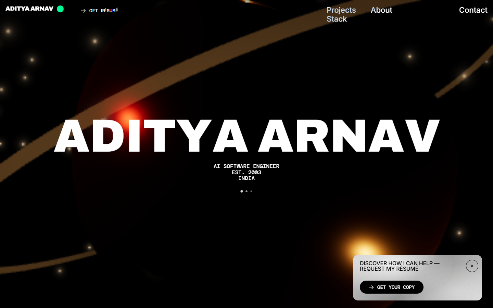
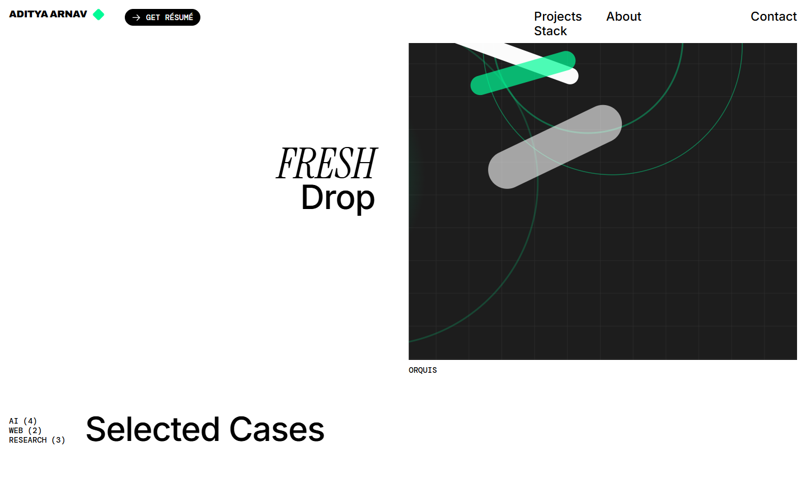

<div align="center">

# 🚀 Aditya Arnav — Portfolio

### See what I build, in one scroll.

**Interactive 3D scenes · Real projects with source links · Résumé one click away**

[](https://aditya-arnav-portfolio.vercel.app)




</div>

This is the personal portfolio of Aditya Arnav, an AI software engineer. Recruiters can skim projects, internships, and patents in one page and request the résumé. Collaborators can open any project's case study and jump to its GitHub repo or live demo.

## 💡 Why you'll like it

| | |
|---|---|
| ⚡ **Everything on one page** | About, experience, projects, patents, stack, and contact, in one scroll. |
| 🗂️ **Projects you can inspect** | Every project opens a case study with its stack and links to the code. |
| 📄 **Résumé on request** | A résumé card and button are always within reach. |
| 🎮 **Fun to explore** | Drag the letters of the name, hover rows to reveal 3D scenes. |
| ♿ **Keyboard and screen-reader friendly** | Project tiles open with Enter or Space, and dialogs close with Escape. |
| 🧘 **Calm mode respected** | With reduced motion on, 3D scenes and looping animations stay off. |

## 🧭 Three steps



1. **Open the site.** Go to [aditya-arnav-portfolio.vercel.app](https://aditya-arnav-portfolio.vercel.app).
2. **Scroll the story.** Move from the intro to projects, patents, and the tech stack.
3. **Get in touch.** Request the résumé or send a message from the Contact section.

## 🌐 Visit or run it

The site is live at **https://aditya-arnav-portfolio.vercel.app**. Nothing to install.

To run it on your own machine:

1. Install [Node.js](https://nodejs.org) 20.19 or newer.
2. Clone the repo and install dependencies (see Development below).
3. Run `npm run dev` and open the address it prints.

| Requirement | Details |
|---|---|
| Browser | A current desktop or mobile browser with WebGL |
| Best experience | Desktop with a mouse: smooth scrolling, cursor effects, and hover scenes are desktop only |
| Node.js | 20.19 or newer, only for running locally |
| Not supported | Browsers without WebGL show the page without its 3D scenes. There is no server, so forms do not send anything on their own. |

## 🔍 What it does

| Stage | What happens |
|---|---|
| Loading | Black curtains and a progress bar cover the page while fonts and scripts load. |
| Hero | The name appears over a 3D scene. Letters can be dragged and reordered. A résumé card slides in. |
| What I do | Title words, a typed paragraph, and a dot grid that shows quotes on hover. |
| Features | Hovering a row brings up a 3D scene next to the pointer. On touch screens the rows step with scroll. |
| Cases | A featured project and a grid of projects. Each opens a full-screen case study. |
| Vision, Numbers, Identity | Scroll-revealed text, counters, and a draggable strip of work, education, and patent cards. |
| Contact | A form that opens your mail app with the message filled in. |

## ⚙️ How it works

```text
 src/data.ts ──► src/site.ts ──► React sections ──► GSAP + Lenis (motion)
  (résumé)       (page copy)          │
                                      └──► three.js scenes (loaded after the page)
```

| Component | Purpose | License |
|---|---|---|
| React | UI components | MIT |
| Vite | Dev server and production build | MIT |
| TypeScript | Type checking | Apache-2.0 |
| GSAP | Scroll and entrance animation | GSAP Standard "no charge" license |
| Lenis | Smooth scrolling on desktop | MIT |
| three.js, @react-three/fiber, @react-three/drei | 3D scenes | MIT |
| SortableJS | Draggable letters in the hero | MIT |
| @vercel/analytics | Page view analytics | MIT |
| Archivo, Instrument Serif, Inter, DM Mono | Fonts, loaded from Google Fonts | SIL Open Font License 1.1 |

The layout and interaction design follow [hobro.digital](https://hobro.digital/), rebuilt from scratch. Free fonts stand in for the reference's licensed ones.

## ⚠️ Known limits

- The contact forms have no backend. They open a pre-filled email in your mail app.
- There are no automated tests.
- Link previews on social media show no image. There is no `og:image` yet.
- On iPhone, "Add to Home Screen" shows no custom icon. It needs a 180×180 PNG.
- The main JavaScript bundle is about 486 kB, mostly animation plugins. Slow connections will see the loader longer.
- Smooth scrolling, the custom cursor, and hover scenes are desktop only.
- Page views are tracked with Vercel Analytics.

## 🛠️ Development

Prerequisites: Git and Node.js 20.19 or newer.

```bash
git clone https://github.com/Hydra-Of-Malice/Aditya-Arnav-portfolio.git
cd Aditya-Arnav-portfolio
npm install
npm run dev
```

| Command | What it does |
|---|---|
| `npm run dev` | Start the dev server |
| `npm run build` | Type-check and build to `dist/` |
| `npm run preview` | Serve the production build |
| `npm run lint` | Lint with oxlint |

| Folder / file | Contents |
|---|---|
| `src/data.ts` | Résumé facts. Edit this, not the components. |
| `src/site.ts` | Turns the data into page sections and copy |
| `src/components/` | One component per section, plus loader, cursor, header, and popups |
| `src/components/three/` | The three WebGL scenes |
| `src/lib/` | GSAP setup, smooth scroll, device detection, hooks |
| `src/styles/` | Design tokens, page chrome, and section styles |
| `docs/` | Screenshots and [architecture notes](docs/ARCHITECTURE.md) |

Build for production:

```bash
npm run build
```

The output in `dist/` is a static site. It is deployed on Vercel.

## 📄 License

All rights reserved. The code is public to read, but no license is granted to reuse it. Third-party components keep their own licenses, listed in How it works above.
